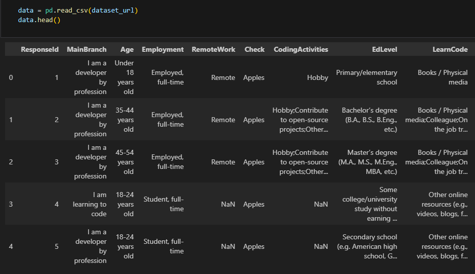
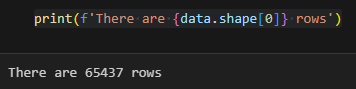
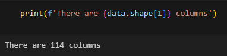
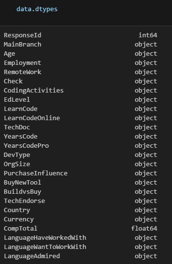
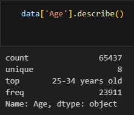
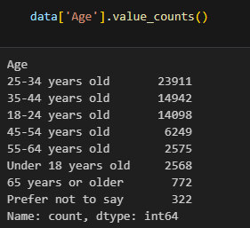
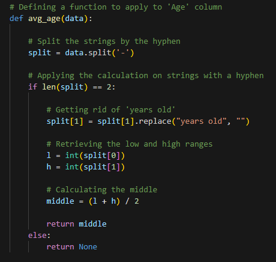
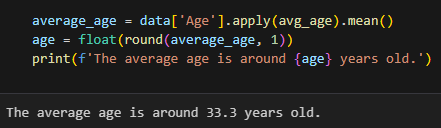
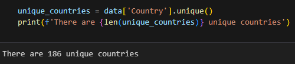

# Exploring The Dataset

This is part of the <a href = 'https://github.com/FaiLuReH3Ro/IBM-DataAnalyst-Capstone'>IBM Data Analyst Capstone - Python</a> project and part of the <a href = 'https://github.com/FaiLuReH3Ro/IBM-DA-Capstone-Py?tab=readme-ov-file#data-collection'>Data Collection</a> section.

## Dataset Used

Stack Overflow’s global survey captures insights on developers’ experience, tools, technologies, and preferences, offering a snapshot of the software development landscape.

[Dataset Source](https://cf-courses-data.s3.us.cloud-object-storage.appdomain.cloud/n01PQ9pSmiRX6520flujwQ/survey-data.csv) (Downloads a CSV)

> Note: This CSV is a subset of the original data

[Original Source](https://stackoverflow.blog/2024/08/06/2024-developer-survey/) (Stack Overflow)

## Objectives 

* Read the dataset into a dataframe
* Exploring some of the data using pandas

## Tools Used

* Jupyter notebook
* Python
* Pandas

